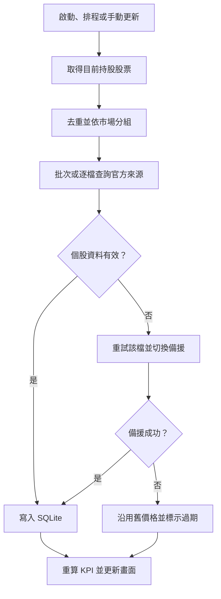

# 股票資訊自動更新規劃 v0.1

## 1. 文件資訊

- 專案名稱：Leveraged Stock Accumulation Manager
- 專案基準：[GitHub Repository](https://github.com/weihaochiu/Leveraged_Stock_Accumulation_Manager)
- 文件日期：2026-08-09
- 文件狀態：討論規劃版，尚未修改程式
- 適用市場：第一階段以台灣上市（TWSE）與上櫃（TPEx）股票及 ETF 為主

## 2. 規劃目標

目前股價由使用者手動更新。後續規劃新增盤後價格自動更新，供持股市值、未實現損益、回本價距離、目標價距離及其他 KPI 計算使用。

本功能的核心原則如下：

1. 預設只向 API 查詢「目前仍有持股」的股票，不下載整個市場資料。
2. 更新失敗不得影響程式啟動、既有交易資料或其他股票的更新。
3. 官方資料來源優先，第三方來源僅作備援。
4. 所有價格都要保留交易日期、取得時間與實際資料來源。
5. 網路中斷時可沿用最近一次成功價格，並清楚標示資料已過期。
6. 保留手動更新功能作為最終備援。
7. SQLite 為唯一正式主資料庫；Excel 僅負責匯入、匯出與備份。

## 3. 已確認的更新範圍

### 3.1 預設納入

- 持股數量大於 0 的股票或 ETF。
- 同一股票即使有多筆交易、不同批次或不同策略，只查詢一次。

### 3.2 預設排除

- 已全部賣出、持股數量為 0 的股票。
- 未持有的市場其他股票。
- 僅存在於歷史交易中、但目前沒有持股的股票。

已全部賣出的股票停止呼叫 API，但保留既有交易紀錄與歷史價格，不刪除資料。

### 3.3 未來可選功能

若後續增加「觀察清單」，可讓使用者逐檔設定是否納入自動更新；第一階段不預設更新未持有股票。

## 4. 資料來源與優先順序

| 層級 | 資料來源 | 用途 |
|---|---|---|
| 第一來源 | TWSE 官方資料服務 | 上市股票與上市 ETF 的盤後資料 |
| 第一來源 | TPEx 官方資料服務 | 上櫃股票與上櫃 ETF 的盤後資料 |
| 第二來源 | 可設定的第三方服務，例如 FinMind | 官方來源多次失敗後的個股備援 |
| 第三來源 | SQLite 最近一次成功價格 | 所有網路來源失敗時維持程式可用 |
| 最終備援 | 使用者手動輸入 | 特殊商品、代號辨識錯誤或資料異常時使用 |

參考入口：

- [TWSE OpenAPI](https://openapi.twse.com.tw/)
- [TWSE 個股日成交資訊](https://www.twse.com.tw/zh/trading/historical/stock-day.html)
- [TPEx OpenAPI](https://www.tpex.org.tw/openapi/)
- [TPEx 個股日成交資訊](https://www.tpex.org.tw/zh-tw/mainboard/trading/info/stock-pricing.html)

正式開發時仍需依當時官方 API 文件確認端點、查詢參數、回傳欄位、資料單位、流量限制及使用條款。

## 5. API 查詢策略

更新時先從 SQLite 取得目前持股清單，再依市場分成 TWSE 與 TPEx，去除重複股票代號後才呼叫 API。

查詢方式的優先順序如下：

1. 資料來源支援多檔代號查詢時，僅將持股代號組成批次請求。
2. 資料來源不支援批次時，才依持股代號逐檔查詢。
3. 單一股票失敗時，只重試該檔，不重新查詢全部股票。
4. 官方個股端點無法使用時，才針對失敗股票切換備援來源。
5. 全市場資料端點不作預設更新方式；未來如保留，只能作為可選的最後網路備援，而且仍只允許將持股資料寫入資料庫。

因此，正式原則為：

> 只查詢目前持有的股票；能批次就批次，不能批次才逐檔。

## 6. 單一股票可取得的盤後資訊

不同端點的欄位名稱與單位可能不同，服務層需轉換成程式統一格式。

| 資料類別 | 常見 API 欄位 | 程式用途 |
|---|---|---|
| 股票識別 | 股票代號、股票名稱 | 對應持股與驗證回傳標的 |
| 市場 | 上市、上櫃 | 選擇正確 Provider，避免跨市場誤配 |
| 交易日期 | 成交日期 | 判斷是否為最新交易日 |
| 開盤價 | 當日第一筆成交價 | 預留 K 線與波動分析 |
| 最高價 | 當日最高成交價 | 預留波動分析 |
| 最低價 | 當日最低成交價 | 預留波動分析 |
| 收盤價 | 當日最後成交價 | 更新目前股價、持股市值與 KPI |
| 漲跌價差 | 相較前一交易日的價格變化 | 顯示每日漲跌 |
| 成交量 | 成交股數或成交張數 | 流動性與成交量分析 |
| 成交金額 | 當日成交總額 | 流動性分析 |
| 成交筆數 | 當日成交筆數 | 交易活躍程度分析 |

官方個股日成交端點有可能回傳指定月份的每日資料，而非只回傳當日一筆。程式應從回傳資料中辨識最新有效交易日，再依既定保存政策寫入或更新資料庫。

### 6.1 寫入前的統一格式

建議將不同來源統一為下列欄位：

```text
股票代號
股票名稱
市場（TWSE／TPEx）
交易日期
開盤價
最高價
最低價
收盤價
成交股數
成交金額（元）
成交筆數
漲跌價差
資料來源
資料取得時間
報價類型
是否為手動覆寫
```

如果來源以「張」或「仟元」回傳，Provider 必須依該端點的官方定義轉換為「股」與「元」，不可只根據欄位名稱猜測單位。

### 6.2 由程式自行計算的資訊

下列資料不需直接依賴盤後 API：

- 漲跌百分比。
- 持股目前市值。
- 未實現損益。
- 距離回本價百分比。
- 距離目標價百分比。
- 累積投入報酬率。
- 槓桿部位風險指標。

### 6.3 第一階段不包含的資訊

單一股票盤後成交資料通常不直接包含：

- 個人持股數量與成本。
- ETF 淨值與折溢價。
- 配息紀錄與除權息日。
- 本益比、殖利率與股價淨值比。
- 三大法人買賣超。
- 融資融券。
- 即時五檔買賣價格。
- 公司財務資料。

若未來需要上述內容，應另建專用 Provider 與資料表，不混入第一階段的收盤價更新流程。

## 7. 自動更新時機

### 7.1 程式啟動時

1. 讀取目前持股股票。
2. 檢查每檔股票最後成功價格的交易日期。
3. 已是最新可取得交易日的股票不重複下載。
4. 價格落後時，在背景執行補更新，避免 GUI 凍結。

### 7.2 程式持續開啟時

建議盤後排程：

- 14:30：第一次更新。
- 15:00：未取得當日資料者第一次重試。
- 17:00：仍未取得當日資料者第二次重試。

實際排程時間未來應放在設定頁供使用者調整。週末、休市日與國定假日不應被誤判為缺少當日資料；需要交易日判斷機制，或以 API 最新有效交易日為準。

### 7.3 手動觸發

保留下列入口：

- 更新全部目前持股。
- 更新選取股票。
- 手動輸入價格。

## 8. 更新流程



每檔股票應有獨立結果。某一檔更新失敗，不得取消其他股票已成功的更新。

## 9. 資料驗證規則

API 資料通過驗證後才可寫入正式價格紀錄：

1. 回傳股票代號必須與請求代號一致。
2. 市場必須正確，不能將上市股票誤配為上櫃股票，反之亦然。
3. 收盤價必須為有效數值且大於 0。
4. 交易日期不得晚於目前日期。
5. 同一來源、同一股票及同一交易日不得重複新增相同紀錄。
6. 空值、`--`、停止交易或無成交資料不得寫成 0 元。
7. 與前一筆價格差異過大時顯示異常警告，但不應只靠固定漲跌幅自動刪除或拒絕。
8. 大幅價格差異可能來自除權息、分割、減資或恢復交易，應保留人工確認空間。
9. 成交量與成交金額需先依來源單位標準化。
10. API 回傳成功但沒有最新交易日資料時，視為「資料尚未發布」，不能假裝更新成功。

## 10. 重試、備援與價格優先序

### 10.1 自動重試

官方來源暫時失敗時，建議同一檔最多重試三次，間隔可採 2、5、15 秒。正式實作時可加入隨機抖動，避免多個請求同時重送。

### 10.2 切換備援來源

官方來源重試仍失敗後，才切換第三方來源。資料庫必須記錄實際使用的來源，不可全部只記為「自動更新」。

### 10.3 沿用最近成功價格

全部網路來源失敗時：

- 主表仍可使用最近一次成功價格進行暫時計算。
- 價格必須標示為「快取／已過期」。
- 不可將更新失敗的時間寫成新的價格日期。
- 顯示價格距今過期天數與最近一次失敗原因。

### 10.4 手動覆寫

手動價格只影響指定股票與指定交易日，不永久停用後續自動更新。

同一股票、同一交易日的採用優先序建議為：

```text
手動覆寫 > 官方價格 > 備援來源 > 舊快取
```

若日後允許取消手動覆寫，應能恢復採用該日已保存的官方或備援價格，而不是刪除所有價格紀錄。

## 11. 資料庫規劃

既有 `price_history` 可作為基礎，建議至少保存或補充：

| 欄位 | 說明 |
|---|---|
| stock_id／symbol | 股票識別與代號 |
| exchange | `TWSE` 或 `TPEx` |
| trade_date | 價格所屬交易日 |
| open／high／low／close | 當日開高低收 |
| volume_shares | 已統一為股的成交量 |
| turnover_twd | 已統一為元的成交金額 |
| transaction_count | 成交筆數 |
| price_change | 漲跌價差 |
| source | 實際資料來源 |
| quote_type | 收盤價、延遲價格或手動價格 |
| fetched_at | 實際取得資料的時間 |
| is_manual_override | 是否為人工覆寫 |
| created_at／updated_at | 資料庫建立與修改時間 |

另建 `price_update_runs` 或等效更新紀錄表，保存：

- 更新批次開始與結束時間。
- 觸發方式：程式啟動、排程、手動全部或手動單檔。
- 預計更新股票數。
- 成功、備援成功、失敗與略過數量。
- 每檔實際來源、重試次數與錯誤訊息。
- 每個來源的最後成功時間與連續失敗次數。

資料庫查詢最新價格時，不能只依修改時間決定；必須同時考慮交易日期與來源優先序，避免同一天的官方價格和手動價格互相誤蓋。

## 12. 資料庫大小評估

API 下載範圍與資料庫寫入範圍是兩件事。即使曾使用全市場端點，只要僅保存持股資料，資料庫也不會因下載全市場資料而直接膨脹；但本規劃仍以只查持股為預設，以降低傳輸量與不必要處理。

以 30 檔持股、每年約 250 個交易日估算：

```text
30 × 250 = 每年約 7,500 筆
10 年約 75,000 筆
```

此規模對 SQLite 很小，通常僅為數 MB 至十幾 MB，實際大小取決於索引、欄位型態、更新日誌與是否保存完整日線資料。

建議建立唯一索引，至少涵蓋股票、市場、交易日期、資料來源與報價類型，並為「取得每檔最新有效價格」建立適當索引。

## 13. GUI 顯示規劃

「股票價格」頁建議顯示：

| 欄位 | 內容 |
|---|---|
| 股票 | 股票代號與名稱 |
| 市場 | 上市／上櫃 |
| 目前價格 | 依優先序實際採用的價格 |
| 今日漲跌 | 漲跌金額與百分比 |
| 價格日期 | 報價所屬交易日 |
| 取得時間 | 實際下載或手動輸入時間 |
| 來源 | TWSE／TPEx／備援／手動 |
| 狀態 | 最新／備援／過期／失敗 |
| 訊息 | 錯誤、異常或資料尚未發布原因 |

主畫面狀態列範例：

> 股價最後更新：2026-08-07 14:32｜成功 12／失敗 1｜1 檔使用過期價格

錯誤訊息應指出股票、資料來源與失敗原因，不只顯示籠統的「更新失敗」。背景更新期間應顯示進度，但不可阻塞 GUI 操作。

## 14. 模組化架構規劃

自動股價功能不應全部放入單一 `price_service.py`。建議拆分如下：

```text
stock_manager/pricing/
├─ providers/
│  ├─ base_provider.py
│  ├─ twse_provider.py
│  ├─ tpex_provider.py
│  └─ fallback_provider.py
├─ price_update_service.py
├─ price_validator.py
├─ price_scheduler.py
└─ models.py
```

各模組責任：

- `providers/`：處理各來源請求、回傳解析與單位標準化。
- `price_update_service.py`：取得持股清單、去重、分組、協調重試與備援、寫入資料庫。
- `price_validator.py`：執行代號、日期、價格、單位與異常差異檢查。
- `price_scheduler.py`：管理啟動補更新與盤後排程。
- `models.py`：定義統一報價資料模型與更新結果模型。

GUI 只負責觸發、顯示進度與呈現結果，不直接處理 HTTP 請求、欄位轉換或備援切換。

## 15. 建議實作階段

### 第一階段：核心盤後更新

- 只更新目前持股。
- 支援 TWSE 與 TPEx 官方盤後價格。
- 程式啟動時補更新。
- 保留全部更新、選取更新與手動輸入。
- 儲存來源、交易日期及取得時間。
- 更新失敗時沿用舊價格並標示過期。

### 第二階段：可靠性與維護

- 加入第三方備援 Provider。
- 加入盤後排程與交易日判斷。
- 加入更新批次紀錄、來源健康狀態及錯誤明細。
- 加入取消手動覆寫與價格來源切換檢視。

### 第三階段：進階資料

- 視實際需求決定是否增加觀察清單。
- 評估 K 線、成交量與市場狀態分析。
- 另行評估 ETF 淨值、配息、法人與融資融券資料。
- 只有在投資管理需求明確時，再評估盤中即時或延遲報價。

## 16. 尚待確認事項

正式修改程式前仍需確認：

1. 第一階段是否只保存最新收盤價，或同時回補並保存完整每日 OHLCV 歷史。
2. 第三方備援來源採用哪一家，以及是否接受 API Key。
3. 盤後排程時間是否固定為 14:30、15:00、17:00，或全部可設定。
4. 手動覆寫是否需要核准、備註與取消功能。
5. 觀察清單是否納入第一版，或留到後續版本。
6. 價格異常警告的門檻與除權息辨識方式。
7. 是否需要在 Excel 匯出中包含完整價格歷史與更新紀錄。

---

本文件僅記錄目前已討論的功能規劃與設計方向；在使用者確認前，不修改現有軟體與資料庫。
